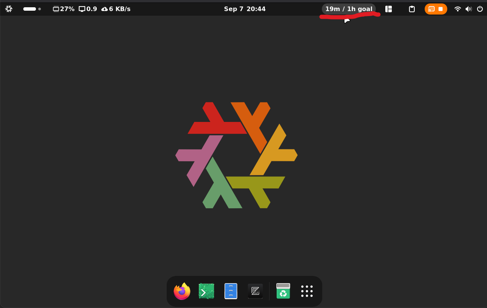

# hackastats



A simple GNOME shell extension displaying today data for [hackatime](https://github.com/hackclub/hackatime) compatible coding time trackers.

> [!IMPORTANT]
> The only officially supported server is [official hackatime instance](https://hackatime.hackclub.com/).
> If your server doesn't work, feel free to submit a PR adding compatibility with it.

## Installation

This extension supports only GNOME 45+.
Check your GNOME version with:

```bash
gnome-shell --version
```

### From extensions.gnome.org (EGO) — recommended

> [!NOTE]
> This extension has been submitted to [extensions.gnome.org](https://extensions.gnome.org/) and is currently waiting for approval.
> Once approved, it will be installable from there. Until then, use the [standalone installation](#standalone) below.

Once approved:

1. Open the [Hackastats page on EGO](https://extensions.gnome.org/extension/10942/hackastats/) (or search for `Hackastats` on <https://extensions.gnome.org/>).
2. Flip the switch to `ON` and confirm the installation.
3. Alternatively, in the [Extension Manager](https://github.com/mjakeman/extension-manager) app, search for `Hackastats` under _Browse_ and click _Install_.

### Standalone

#### From a release bundle

1. Download the `hackastats@first-uninteresting-username.github.io.shell-extension.zip` file from the [Releases page](https://github.com/first-uninteresting-username/hackastats/releases).

2. Install it:

```bash
gnome-extensions install --force hackastats@first-uninteresting-username.github.io.shell-extension.zip
```

3. Enable the extension:

```bash
gnome-extensions enable hackastats@first-uninteresting-username.github.io
```

You can also enable it with the _Extensions_ or _Extension Manager_ app.

4. Log out and log back in to apply changes.

#### From source

1. Clone the repository:

```bash
git clone https://github.com/first-uninteresting-username/hackastats.git
```

2. Copy the extension to your local extensions directory and compile the schemas:

```bash
mkdir -p ~/.local/share/gnome-shell/extensions
cp -r hackastats/hackastats@first-uninteresting-username.github.io ~/.local/share/gnome-shell/extensions/
glib-compile-schemas ~/.local/share/gnome-shell/extensions/hackastats@first-uninteresting-username.github.io/schemas/
```

3. Enable the extension:

```bash
gnome-extensions enable hackastats@first-uninteresting-username.github.io
```

You can also enable it with the _Extensions_ or _Extension Manager_ app.

4. Log out and log back in to apply changes.

## Configuration

You can configure this extension using dconf. Preferences page is also available, but it's self explanatory (duh, no it's not).

All settings live under `/org/gnome/shell/extensions/hackastats` path. Here are the keys:

- `/org/gnome/shell/extensions/hackastats/api-key` - an API key for your hackatime server. Overwritten by `~/.wakatime.cfg`.
- `/org/gnome/shell/extensions/hackastats/base-url` - the base API URL for your hackatime server. Overwritten by `~/.wakatime.cfg`.
- `/org/gnome/shell/extensions/hackastats/position` - position on the GNOME panel, 0 is left, 1 is center and 2 is right. Defaults to 2 (on the right).
- `/org/gnome/shell/extensions/hackastats/refresh-interval` - how often should the data refresh, in seconds. Defaults to 30.

## Usage

Configure base url and api key (in dconf or by setting them in `~/.wakatime.cfg`).
If the displayed text says `Server unavailable`, the extension cannot access the server.
This usually means that you don't have network access or your base url is wrong.

## Development setup

The development setup is explained in [CONTRIBUTING.md](/CONTRIBUTING.md)

(tldr: use devenv)

## Disclaimer

This project is not affiliated with [Wakatime](https://wakatime.com/) in any way

## License

This project is licensed under the GNU General Public License v2.0 or later (SPDX: `GPL-2.0-or-later`).
See [LICENSE](/LICENSE) for the full text.
